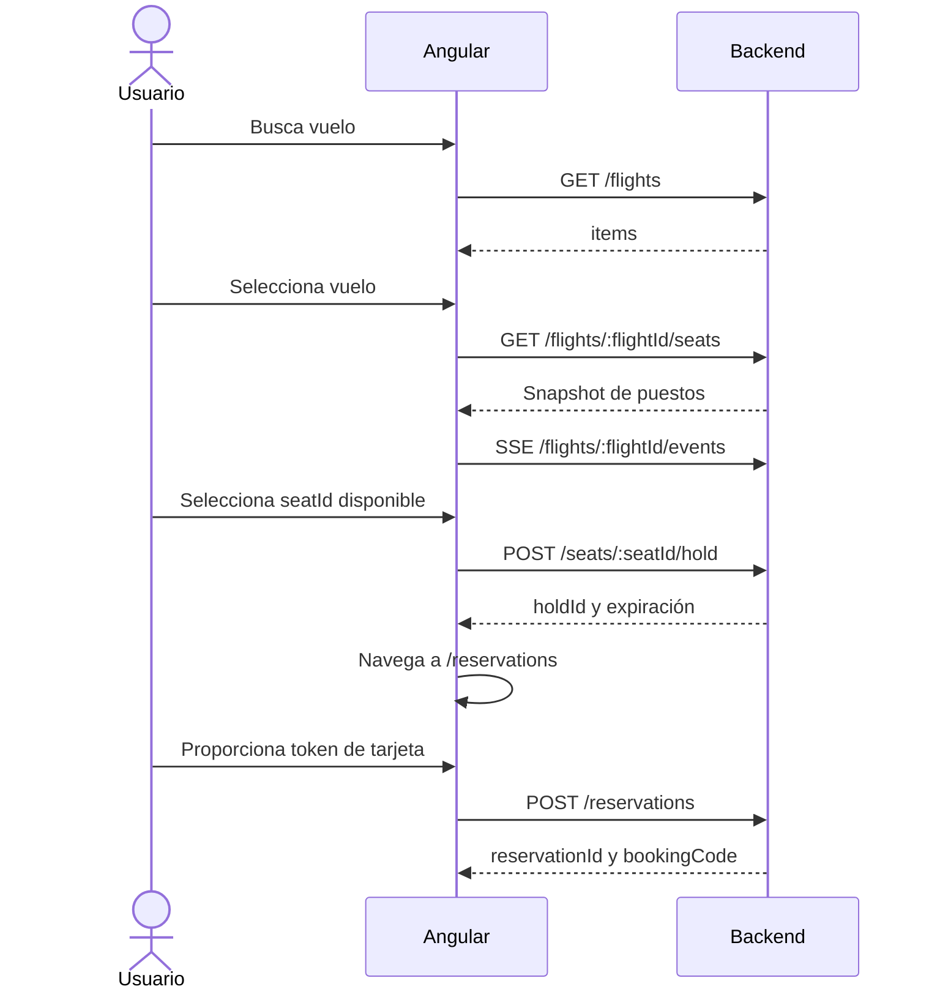

# Flight Front: Arquitectura

## Propósito

Cliente Angular 21 para buscar vuelos, obtener un mapa de puestos, recibir cambios en tiempo real, crear una retención y confirmar una reserva con pago tokenizado.

## Stack y estructura

- Angular 21 standalone, Signals, formularios reactivos y Angular Material.
- RxJS para HTTP y SSE.
- Vitest mediante Angular CLI.
- Backend: `http://localhost:3000/api/v1`.

```text
src/app/
  core/
    models/sse-event.model.ts            Envelope genérico SSE.
    services/sse.service.ts              Transporte EventSource reusable.
  features/
    flights/
      models/                            DTOs de vuelo, puestos y eventos.
      services/                          HTTP de vuelos, puestos y eventos SSE.
      state/flight-seat-map.state.ts     Estado incremental del mapa.
      pages/flight-search/               Búsqueda.
      pages/flight-seat-map/             Pasajero, mapa y hold.
    reservations/
      services/reservation.ts            Confirmación de reserva.
      pages/reservation/                 Resumen y token de pago.
  app.config.ts                          HTTP, router y animaciones.
  app.routes.ts                          Rutas lazy.
```

## Rutas

| Ruta | Página | Propósito |
| --- | --- | --- |
| `/flights` | `FlightSearch` | Busca vuelos por origen, destino y fecha. |
| `/flights/:flightId/seats` | `FlightSeatMap` | Captura pasajero y muestra el mapa del vuelo. |
| `/reservations` | `Reservation` | Confirma la reserva con un hold vigente. |

Las páginas usan `loadComponent`, por lo que se cargan bajo demanda.

## Flujo



## Snapshot y SSE

La pantalla de puestos siempre sigue este orden:

1. `GET /api/v1/flights/{flightId}/seats` carga el snapshot.
2. `GET /api/v1/flights/{flightId}/events` abre una sola conexión SSE para ese vuelo.
3. Cada evento modifica solo el asiento señalado por `payload.seatId`.
4. Al perder la conexión, `FlightEventsService` espera un segundo, recarga el snapshot y reabre SSE.
5. Al abandonar la página, `takeUntilDestroyed` cierra EventSource y elimina la suscripción.

`SseService` solo administra transporte, parsing y cleanup. `FlightEventsService` conoce la URL y los eventos de vuelos. `FlightSeatMapState` aplica los cambios incrementales a Signals.

Eventos compatibles:

| Evento | Cambio local |
| --- | --- |
| `SeatHeld` | `HELD`, con `holdId` y `holdExpiresAt`. |
| `SeatReleased` | `AVAILABLE`, sin hold. |
| `SeatHoldExpired` | `AVAILABLE`, sin hold. |
| `SeatOccupied` | `OCCUPIED`, sin hold. |

Envelope:

```json
{
  "eventId": "uuid",
  "type": "SeatHeld",
  "version": 1,
  "occurredAt": "2026-09-25T00:00:00.000Z",
  "flightId": "THA001",
  "aggregateId": "2C",
  "payload": {
    "seatId": "2C",
    "status": "HELD",
    "holdId": "uuid",
    "expiresAt": "2026-09-25T00:10:00.000Z"
  }
}
```

## Contratos HTTP

### Búsqueda

```text
GET /api/v1/flights?origin=Bog&departureDate=2026-09-25&destination=Mex
```

El frontend muestra `response.items` y transfiere la tarifa únicamente al siguiente paso de navegación.

### Snapshot de puestos

```text
GET /api/v1/flights/{flightId}/seats
```

Contrato canónico del frontend:

```ts
interface SeatDto {
  seatId: string;
  row: number;
  column: string;
  cabinClass: string;
  status: 'AVAILABLE' | 'HELD' | 'OCCUPIED';
  holdId: string | null;
  holdExpiresAt: string | null;
}
```

### Hold

```text
POST /api/v1/flights/{flightId}/seats/{seatId}/hold
```

```json
{ "userName": "Maria Perez", "userDocument": "1030630683" }
```

La respuesta incluye `holdId`, `flightId`, `seatId`, `expiresAt` y `expiresInSeconds`.

### Confirmación de reserva

```text
POST /api/v1/reservations
```

```json
{
  "flightId": "THA001",
  "seatId": "2C",
  "holdId": "uuid-de-hold",
  "operationId": "uuid-por-intento",
  "payment": { "cardToken": "token-del-gateway" }
}
```

La respuesta esperada contiene `reservationId`, `bookingCode` y `status: "CONFIRMED"`.

## Identificadores y seguridad

- `seatId` es el identificador canónico de puesto en HTTP, SSE y estado local.
- `holdId` identifica una retención temporal; no es un `reservationId`.
- `reservationId` solo proviene de `POST /reservations` cuando la reserva fue confirmada.
- PAN y CVV no se guardan en Signals, servicios singleton, estado de navegación ni almacenamiento web. El frontend solo envía un `cardToken` al endpoint de reservas.

## Discrepancia observada del backend

El backend local actual devolvía `number` en el snapshot de puestos y `seatNumber` en la respuesta de hold. El contrato objetivo exige `seatId`. `SeatService` normaliza el snapshot temporalmente a `seatId` para preservar el mapa visual, pero el backend debería migrar esos campos a `seatId` y añadir `holdId`/`holdExpiresAt` al snapshot para eliminar el adapter.

La verificación por `OPTIONS` confirmó que el backend local expone `/api/v1/flights/{flightId}/events` y `/api/v1/reservations`. La confirmación funcional de dos clientes requiere ejecutar el backend SSE y abrir dos navegadores en el mismo vuelo.

## Validación

```bash
npm test -- --watch=false
npm run build
```

Las pruebas cubren transporte SSE y cleanup, los cuatro eventos incrementales, snapshot/hold HTTP y confirmación de reserva.